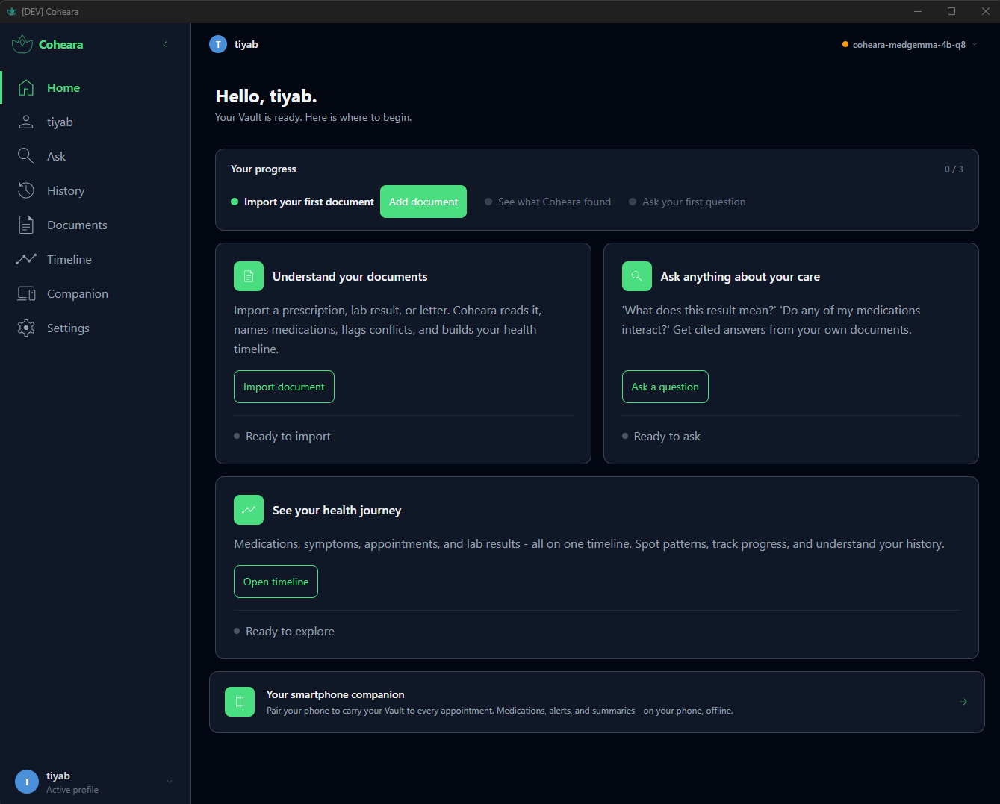
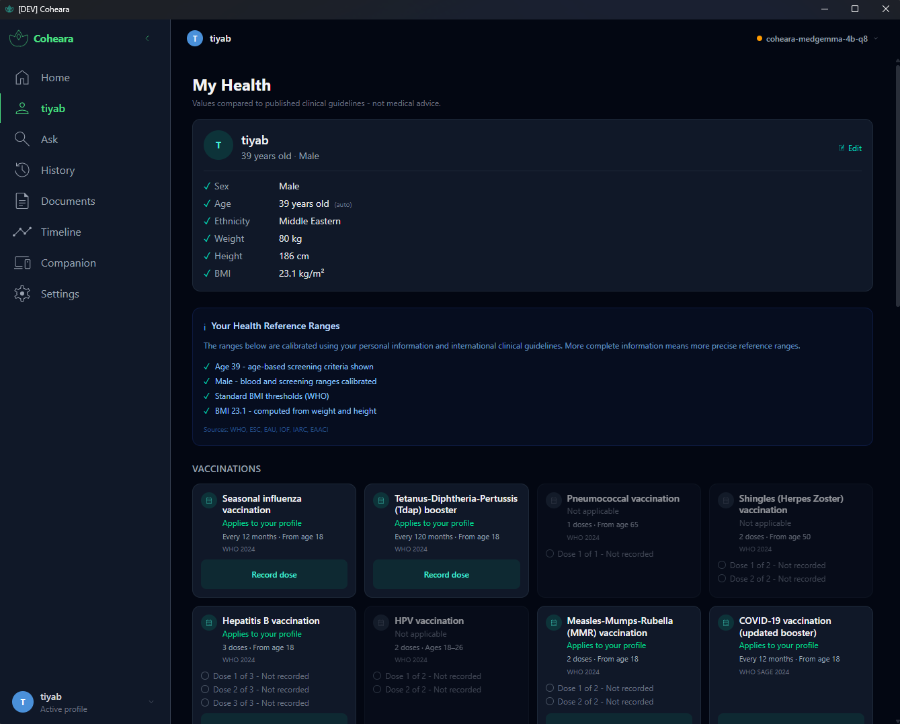
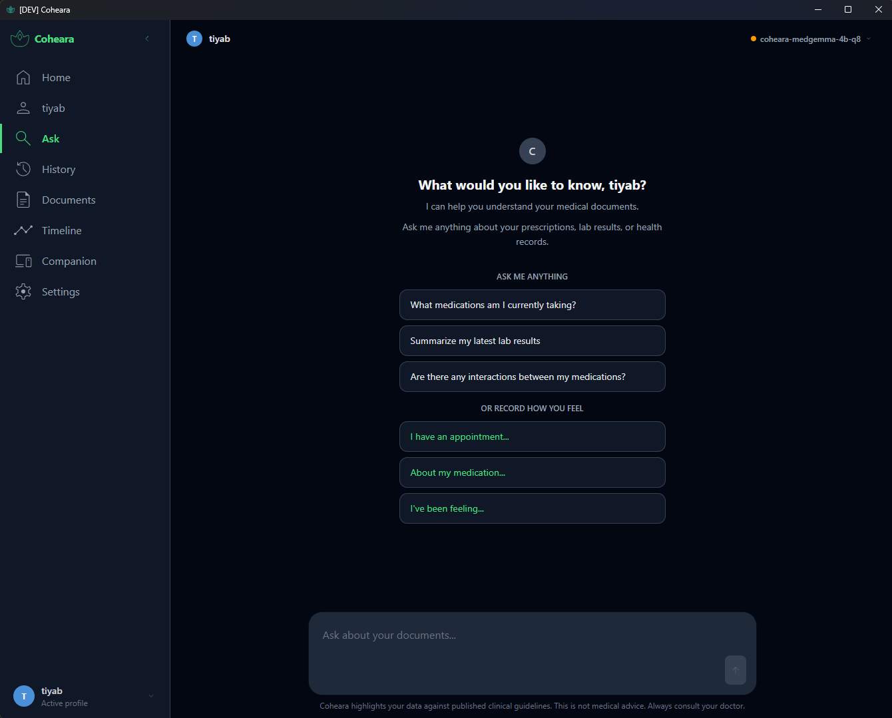
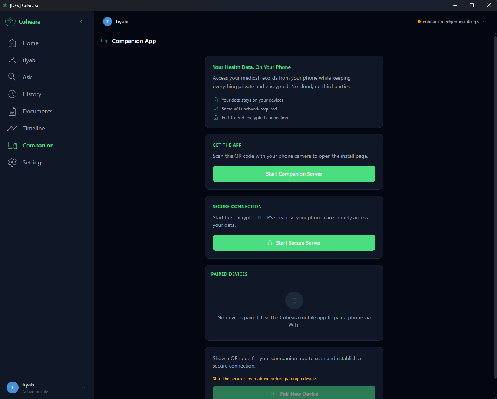
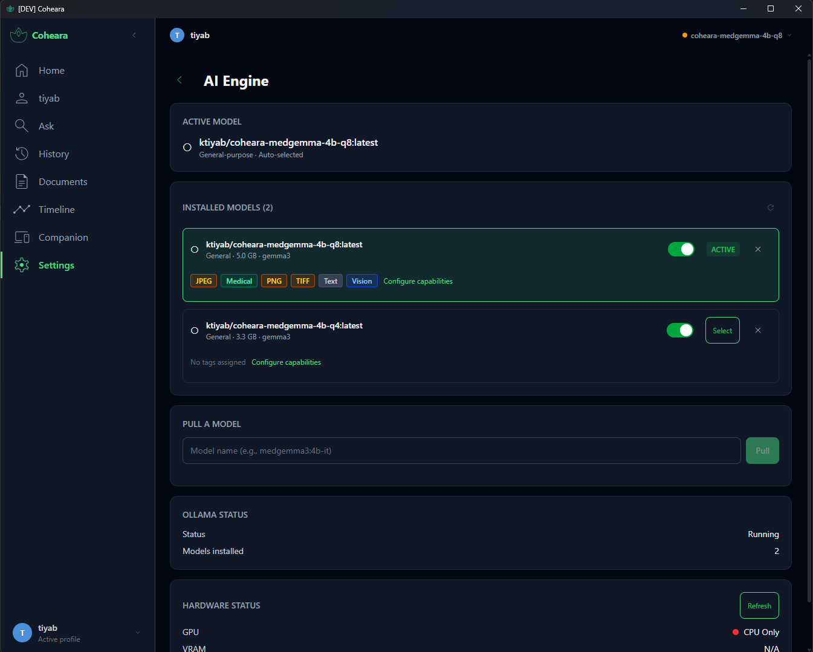
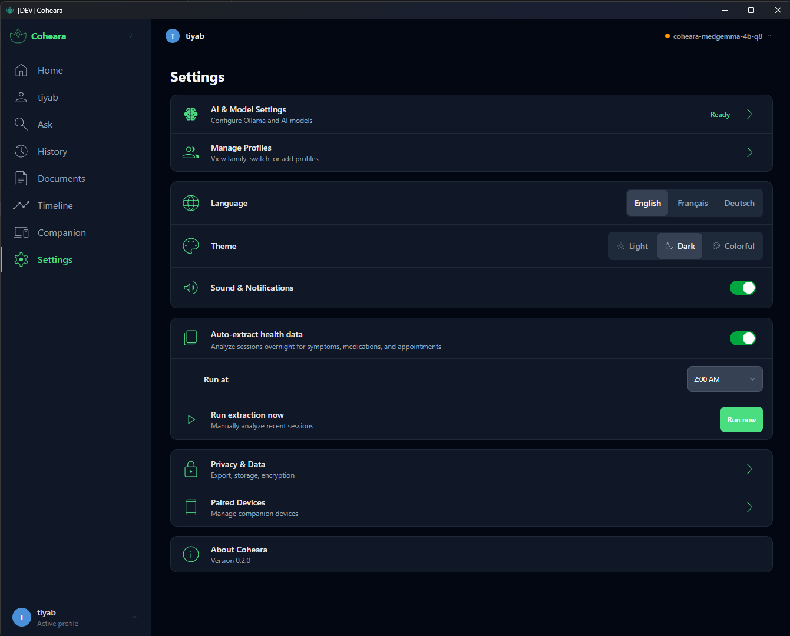

# Coheara


<p align="center">
  
</p>

> **Alpha: Functional but not clinically validated.**
>
> Coheara is a working application with production-grade encryption, structured data extraction, and a mobile companion. However, it has **not** been tested with real patient populations, validated for clinical decision-making, or reviewed for regulatory compliance. APIs, data models, and storage formats may change between versions without migration support.
>
> The AI extracts structured health data from your documents, but extractions may be incomplete or incorrect. Coheara does not diagnose, prescribe, or replace professional medical judgment. It helps you understand your records and prepare better questions for your doctor. You are responsible for verifying any information it surfaces.
>
> **Powered by [MedGemma](https://ai.google.dev/gemma/docs/medgemma)**, Google's open-weight medical SLM, running locally via [Ollama](https://ollama.com). MedGemma is the core engine: it reads documents, extracts structured health data, and answers questions. Without it, Coheara cannot function. MedGemma is licensed separately under Google's [Health AI Developer Foundations (HAI-DEF) Terms of Use](https://developers.google.com/health-ai-developer-foundations/terms). By downloading the model you accept those terms. See [License](#license) for details.
>
> **Custom model builds.** Coheara builds its own MedGemma variants directly from [Google's official safetensors](https://huggingface.co/google/medgemma-1.5-4b-it), not from community-converted GGUFs which can break vision capabilities ([ollama/ollama#9967](https://github.com/ollama/ollama/issues/9967)). This guarantees working text + vision in a single model, with full supply chain traceability from Google's source to your machine. Four variants are available, built and benchmarked for Coheara's extraction workload:
>
> | Variant | Size | Hardware | Install |
> |---------|------|----------|---------|
> | [Q4](https://ollama.com/ktiyab/coheara-medgemma-4b-q4) | 3.3 GB | 4 GB+ RAM | `ollama pull ktiyab/coheara-medgemma-4b-q4` |
> | [**Q8** (recommended)](https://ollama.com/ktiyab/coheara-medgemma-4b-q8) | 5.0 GB | 8 GB+ RAM | `ollama pull ktiyab/coheara-medgemma-4b-q8` |
> | [F16](https://ollama.com/ktiyab/coheara-medgemma-4b-f16) | 8.6 GB | 12 GB+ RAM | `ollama pull ktiyab/coheara-medgemma-4b-f16` |
> | [Q4s](https://ollama.com/ktiyab/coheara-medgemma-4b-q4s) | 3.2 GB | 4 GB+ RAM | Research only |
>
> Or build from source: `./setup-medgemma.sh`. See [`coheara-medgemma/`](coheara-medgemma/) for benchmarks and details.
>
> Contributions, feedback, and testing are welcome. See [Getting Started](#getting-started).

---

A private, locally-run medical document vault designed to solve the global problem of fragmented healthcare records.

You collect prescriptions, lab reports, discharge summaries, and medical letters from every doctor you see. They pile up: paper in folders, PDFs in downloads, photos on your phone. No single person sees the complete picture. Not even your doctor.

When things fall through the cracks (a medication conflict between two specialists, a lab result that contradicts a diagnosis, a dosage change you were never told about) you are the one who pays.

**Coheara changes that.** It is a personal medical AI that runs entirely on your computer. Import your documents. Coheara reads them, structures them, and helps you understand your care.

- Ask questions in your own words and get cited, grounded answers
- Spot inconsistencies across doctors, medications, and lab results, turning confusion into clear questions for your next appointment
- Prepare for appointments with organized summaries and the right questions
- Track medications, symptoms, and health events over time

When you walk into the doctor's office, your smartphone MedAI companion carries your personal Vault with you: medications, alerts, summaries, all synchronized over local WiFi. No cloud. No account. Just your personal devices talking to each other.

**What Coheara never does:** diagnose, prescribe, or give medical advice. It has comprehension authority, not clinical authority. When it finds something worth discussing, it says: *"Ask your doctor about this."*

Your professionals bring clinical judgment. You bring understanding and the right questions. Coheara is the bridge that makes the conversation productive for both sides.

```
                 Health Professional
                  clinical judgment
                 ▲                 ▲
                /                   \
        better /                     \ better
     encounter/                       \encounter
              /                         \
         You ◄───────────────────────────► Coheara
    your questions            comprehension + preparation
              \                         /
               \       personal        /
                └──────► Vault ◄──────┘
```

---

## Who It's For

### Managing your own health

Leila is 29, healthy, and assumes she has no need for a medical tool. Her records tell a different story: lab results in three email inboxes, a vaccination booklet she last saw during a move, and an allergist's letter she photographed but never filed. When a new doctor asks her medical history, she guesses.

If that sounds familiar, Coheara is for you. Import your documents (PDFs, photos, scans) and let the AI organize what you never had time to. Take a photo of a prescription and ask *"what does this mean?"* Pull up your full medication list on your phone at the pharmacy instead of trying to remember drug names. Simple by default, detailed on demand.

### Caring for someone else

Thomas drives his mother Jeanne to four specialists. Each knows their own prescriptions; none sees the full picture. After a fall, the ER doctor asks what medications Jeanne takes. Thomas scrolls through photos, reads handwriting aloud, and misses the interaction between a cardiologist's blood thinner and a rheumatologist's anti-inflammatory. 80% of adverse events in care transitions involve exactly this kind of information gap.

Coheara lets you manage another person's documents in a separate encrypted profile. It detects conflicts across providers, generates appointment summaries, and puts the complete picture on your phone. When you are in the room with the person you care for, you carry their alerts, medication history, and what changed since the last visit, not scattered photos and half-remembered drug names.

### Families and shared access

Clara and Mehdi raise two children. Pediatric visits, allergy tests, vaccination schedules, all split across two parents, two phones, and a drawer of paper. Neither has the full timeline. With multi-profile access, both parents see the same structured data for each child, synchronized over local WiFi. No shared cloud account. No forwarded PDFs. One source of truth per family member, each in its own encrypted vault.

### Privacy without compromise

Coheara runs offline, encrypts each profile with AES-256-GCM, stores nothing in the cloud, makes zero network calls, and collects zero telemetry. Every privacy claim is architecturally enforced and verifiable: no accounts, no tracking, no phone-home. The phone syncs over local WiFi only, locks behind biometrics, and if you revoke the pairing, all cached data is erased. It works the same in Paris, Dakar, and rural Ontario: 8 GB of RAM, no GPU, no internet, three languages.

The desktop is where you prepare. The phone is where you show up informed.

---

## How It Works

Coheara is a **two-app system**: a desktop application that does the heavy lifting (AI, OCR, storage) and a mobile companion that puts your health data in your pocket.

```
┌──────────────────────────┐         WiFi         ┌──────────────────────────┐
│   Desktop (Tauri)        │◄═══════════════════►  │   Phone (PWA/Capacitor)  │
│                          │   encrypted sync      │                          │
│  Import documents        │                       │  View medications        │
│  OCR + AI structuring    │   REST + WebSocket    │  Check lab results       │
│  RAG chat (MedGemma)     │   X25519 key exchange │  Read alerts             │
│  Coherence detection     │   Token rotation      │  Log symptoms            │
│  Encrypted SQLite store  │                       │  Prepare for appointments│
│  Vector search (ONNX)    │   ┌──────────────┐    │  Capture documents       │
│  Distribution server ────│──►│ Install page  │    │                          │
└──────────────────────────┘   │ QR code scan  │    └──────────────────────────┘
     Everything computed       │ APK / PWA     │       Reads cached data
     and stored here           └──────────────┘        Works offline too
```

The desktop is the brain. The phone is the window. Install the companion by scanning a QR code from the desktop, no app store needed. Pair once, then they sync automatically whenever they share a network.

---

## What You Can Do

<table>
  <tr>
    <td width="50%" align="center">
      <br>
      <b>My Health</b><br>
      <sub>Profile-calibrated reference ranges, WHO vaccine schedules, screening reminders. Sources cited from 30+ international guidelines.</sub>
    </td>
    <td width="50%" align="center">
      <br>
      <b>Ask Anything</b><br>
      <sub>RAG chat powered by MedGemma. Cited answers grounded in your own documents, with safety filtering and guideline context.</sub>
    </td>
  </tr>
  <tr>
    <td width="50%" align="center">
      <br>
      <b>Phone Companion</b><br>
      <sub>Carry your vault to every appointment. Encrypted sync over local WiFi, no cloud, no account. Install via QR code.</sub>
    </td>
    <td width="50%" align="center">
      <br>
      <b>AI Engine</b><br>
      <sub>Manage Ollama models with capability tags (Vision, Medical, Text). Pull, configure, and switch models from the app.</sub>
    </td>
  </tr>
  <tr>
    <td width="50%" align="center" colspan="2">
      <br>
      <b>Settings</b><br>
      <sub>Three languages (EN/FR/DE), three themes, overnight batch extraction with configurable schedule, multi-profile management.</sub>
    </td>
  </tr>
</table>

- **Import documents**: prescriptions, lab reports, medical letters (PDF, images, photos)
- **AI structuring**: MedGemma extracts medications, labs, diagnoses, and professionals automatically
- **Spot problems**: automatic conflict, duplicate, gap, and critical value detection
- **Track medications**: current and historical medications with dose and schedule
- **Prepare for appointments**: auto-generated summaries with PDF export for your doctor
- **Browse your timeline**: interactive SVG timeline across all health events
- **Manage family health**: separate encrypted profiles for each family member
- **Back up everything**: encrypted backup files with cryptographic erasure

---

## How the AI Stays Grounded

In medicine, some facts are always true regardless of who the patient is, which country they live in, or which doctor they see. Blood pressure above 140/90 mmHg is hypertension, whether in Paris, Berlin, or Nairobi. Warfarin combined with aspirin raises bleeding risk, no matter who prescribed them. A penicillin allergy means amoxicillin is dangerous, however the allergy was documented. These universal clinical truths are called **medical invariants**. They come from published international guidelines, they don't require judgment, and they are computable: a simple lookup gives the right answer every time.

A 4-billion parameter language model cannot reliably perform these lookups. It hallucinates thresholds, misses drug interactions, invents monitoring intervals. Coheara solves this by encoding invariants as structured, deterministic rules curated from guidelines like ISH, WHO, KDIGO, and ESC, so the AI never has to guess.

```
WITHOUT invariants                        WITH invariants

  Patient asks question                     Patient asks question
        │                                         │
        ▼                                         ▼
  Retrieve documents                        Retrieve documents
        │                                         │
        ▼                                         ▼
  Throw at SLM                              ENRICH with invariants
  "Hope it's correct"                       (deterministic, no LLM)
                                                  │
                                                  ▼
                                            Pre-computed insights
                                            with guideline sources
                                                  │
                                                  ▼
                                            SLM articulates what
                                            invariants determined
```

The SLM's job becomes communication, not classification. It explains what the invariant engine has already determined, with full traceability to the source guideline.

### What invariants catch

**Lab classification.** Your HbA1c is 7.2%. The SLM doesn't guess what that means. The invariant engine classifies it as *Diabetes* (IDF 2025, threshold >= 6.5%) and tells the model:

> `[CRITICAL] HbA1c 7.2%: Diabetes (source: IDF 2025)`

**Drug interactions.** You take Warfarin and Ibuprofen. The engine detects Ibuprofen belongs to the NSAID family, matches the Warfarin + NSAID interaction pair, and injects:

> `[CRITICAL] Warfarin + Ibuprofen: HIGH bleeding risk (source: WHO EML)`

**Missed monitoring.** You're on Metformin but your last HbA1c was 120 days ago. The monitoring schedule requires one every 90 days:

> `[WARNING] Metformin: HbA1c overdue (last: 2025-11-01, interval: 90 days) (source: ADA/KDIGO 2022)`

**Allergy contraindication.** You're allergic to Penicillin and were prescribed Amoxicillin. Both belong to the same drug family:

> `[CRITICAL] Penicillin allergy → Amoxicillin (same Penicillin family) (source: WHO EML)`

### Personalized by your profile

The age, biological sex, and ethnicity you provide during onboarding directly control which thresholds are applied:

- A **male** patient with Hemoglobin 12.5 g/dL gets *"Mild anemia"* (male threshold: 13.0 g/dL, WHO 2024). A female with the same value gets *"Normal"* (female threshold: 12.0 g/dL).
- A **South Asian** patient with BMI 24 gets *"Overweight"* (Asian threshold: 23.0, WHO 2004). A European with the same BMI gets *"Normal"* (standard threshold: 25.0).
- A **52-year-old female** is reminded about mammography screening (IARC/WHO 2024, age 50-74). A 52-year-old male gets prostate screening reminders instead (EAU 2024, age 50-70).

Without these demographics, conservative defaults apply. The system never fails, it only gets more precise with more information.

### By the numbers

| Category | Coverage |
|----------|----------|
| Vital sign types | 6 (BP, HR, SpO2, BMI, Glucose, Temperature) with trend detection |
| Lab tests | 10 (eGFR, HbA1c, LDL, K+, Na+, ALT, Hemoglobin, TSH, uACR, Vitamin D) |
| Multilingual aliases | 88 lab aliases + 88 allergen aliases (EN/FR/DE matching) |
| Drug families | 20 families, 125+ member drugs |
| Drug interactions | 17 clinically significant pairs |
| Cross-reactivity chains | 10 drug allergen families + OAS, food-food, insect, latex-fruit chains |
| Canonical allergens | 46 classes across 5 categories (food, drug, environmental, insect, other) |
| Monitoring schedules | 24 drug-to-lab rules |
| Screening schedules | 14 age+sex-gated (6 cancer screenings + 8 WHO vaccine schedules), record-aware |
| Blood types | 8 ABO/Rh types with transfusion compatibility matrix |
| Detection algorithms | 10 (classify vitals/labs, interactions, cross-reactivity, monitoring, screening, trends, Rh-negative awareness) |
| Unit tests | 300+ (deterministic, no external dependencies) |

Every threshold traces to a published guideline (ISH, ESC, WHO, KDIGO, IDF, EAACI, ISBT, AABB, ACOG, and [30+ more](INVARIANTS.md#source-guideline-index)). Nothing is invented. Nothing is approximated.

For the complete reference (every threshold, every interaction pair, every alias, every source), see **[INVARIANTS.md](INVARIANTS.md)**.

---

## Stack

### Desktop

| Layer | Technology |
|-------|-----------|
| Shell | Tauri 2.10 (Rust + WebView) |
| Frontend | Svelte 5, SvelteKit 2, TailwindCSS 4, Flowbite 4.0 |
| Backend | Rust 1.80+ (1,800+ tests, 0 warnings) |
| Database | SQLite via rusqlite 0.32 (SQLCipher encryption) |
| Vectors | SQLite-backed cosine similarity search |
| Encryption | AES-256-GCM, PBKDF2 600K iterations, BIP39 recovery |
| AI | MedGemma 1.5 4B via Ollama (runs locally) |
| Embeddings | all-MiniLM-L6-v2 via ONNX Runtime |
| PDF / OCR | Google PDFium (pdfium-render 0.8) + MedGemma vision |
| HTTPS | rustls 0.23 + local CA (rcgen 0.13, ECDSA P-256) |
| Phone API | axum 0.7 REST + WebSocket over local HTTPS |
| Key exchange | X25519 Diffie-Hellman (device pairing) |
| Distribution | HTTP server for companion app install (APK + PWA) |
| Bundler | Vite 7 (SPA via adapter-static) |

### Mobile

| Layer | Technology |
|-------|-----------|
| Shell | Capacitor 8 (iOS + Android) or PWA (any browser) |
| Frontend | Svelte 5, SvelteKit 2, TailwindCSS 4 (481 tests) |
| Auth | Face ID / fingerprint via NativeBiometric |
| Storage | Capacitor Preferences (Keychain / Keystore) |
| Camera | Capacitor Camera (document capture) |
| Privacy | PrivacyScreen (FLAG_SECURE / view hiding) |
| Integrity | Root/jailbreak detection (warning, not blocking) |
| Sync | REST + WebSocket over local WiFi |
| PWA | Service worker, offline cache, manifest |

---

## Getting Started

### Prerequisites

| Tool | Version | Install |
|------|---------|---------|
| Node.js | >= 22 | [nodejs.org](https://nodejs.org/) |
| Rust | >= 1.80 | [rustup.rs](https://rustup.rs/) |

**Platform-specific:**

| Platform | Extra dependencies |
|----------|-------------------|
| Windows | [Visual Studio Build Tools 2022](https://visualstudio.microsoft.com/visual-cpp-build-tools/): "Desktop development with C++" workload. WebView2 is pre-installed on Windows 10 (21H2+) and 11. |
| macOS | `xcode-select --install` |
| Linux | `sudo apt-get install build-essential pkg-config libgtk-3-dev libwebkit2gtk-4.1-dev libappindicator3-dev librsvg2-dev patchelf libsoup-3.0-dev libjavascriptcoregtk-4.1-dev` |

**MedGemma via Ollama** (required, Coheara's core AI engine):

```bash
# Install Ollama: https://ollama.com/download
# Pull the recommended Q8 variant (5.0 GB, 8 GB+ RAM)
ollama pull ktiyab/coheara-medgemma-4b-q8
```

Or build from source: `./setup-medgemma.sh` (downloads from [Google's HuggingFace repo](https://huggingface.co/google/medgemma-1.5-4b-it) and builds with vision baked in). See all [variants](https://ollama.com/ktiyab) above. No GPU needed, though one will improve speed. By using MedGemma you accept Google's [HAI-DEF Terms of Use](https://developers.google.com/health-ai-developer-foundations/terms).

### Run the desktop app

```bash
git clone https://github.com/ktiyab/coheara.git
cd coheara
npm install
npm run tauri dev
```

### Install the phone companion

Open Settings, then Companion Setup in the desktop app. Tap "Start Distribution Server", then scan the QR code with your phone.

- **Android**: downloads and installs the APK directly (enable "Install unknown apps" when prompted)
- **iOS**: opens a PWA that installs to the home screen (Safari, Share, Add to Home Screen)

No app store account required.

### Run the mobile app (development)

```bash
cd mobile
npm install
npm run dev          # Web preview at localhost:1421
npm run cap:android  # Build + sync to Android Studio
npm run cap:ios      # Build + sync to Xcode
```

---

## Building for Production

### Desktop installers

```bash
npm run tauri build
```

| Platform | Output | Location |
|----------|--------|----------|
| Windows | `Coheara_0.6.0_x64-setup.exe` (NSIS) | `src-tauri/target/release/bundle/nsis/` |
| Windows | `Coheara_0.6.0_x64_en-US.msi` | `src-tauri/target/release/bundle/msi/` |
| macOS | `Coheara_0.6.0_aarch64.dmg` | `src-tauri/target/release/bundle/dmg/` |
| Linux | `coheara_0.6.0_amd64.deb` | `src-tauri/target/release/bundle/deb/` |
| Linux | `coheara_0.6.0_amd64.AppImage` | `src-tauri/target/release/bundle/appimage/` |

Build a specific format: `npm run tauri build -- --bundles nsis` (or `dmg`, `deb`, `appimage`).

### Mobile: Direct Install (recommended)

```bash
cd mobile
npm run build                           # Build PWA (output: build/)
```

Place `build/` contents at `~/Coheara/mobile-pwa/` and (optionally) a signed APK at `~/Coheara/mobile-apk/coheara.apk`. The desktop app's distribution server serves these to phones on the local network.

### Android (Google Play, optional)

```bash
cd mobile
npm run cap:android                     # Build web + sync
cd android && ./gradlew bundleRelease   # Signed AAB for Play Store
```

Signing requires either `android/keystore.properties` (local) or CI environment variables (`ANDROID_KEYSTORE_FILE`, `ANDROID_KEYSTORE_PASSWORD`, `ANDROID_KEY_ALIAS`, `ANDROID_KEY_PASSWORD`). See `android/keystore.properties.example`.

### iOS (App Store, optional)

```bash
cd mobile
npm run cap:ios                         # Build web + sync
npm run cap:open:ios                    # Open in Xcode
# Xcode > Product > Archive > Distribute App > App Store Connect
```

Requires an Apple Developer account ($99/year) and signing identity. `ios/exportOptions.plist` is preconfigured for App Store distribution.

For most users, the direct install via QR code from the desktop is the simplest path.

---

## Releasing

### Desktop: automated via GitHub Actions

```bash
# 1. Bump version in: tauri.conf.json, Cargo.toml, package.json, mobile/package.json
# 2. Commit and tag
git commit -am "Bump version to vX.Y.Z"
git tag -a vX.Y.Z -m "vX.Y.Z: Release title"
git push origin main --tags
```

This triggers `.github/workflows/release.yml` which builds 4 targets in parallel:

| Runner | Target | Installers |
|--------|--------|------------|
| `windows-latest` | x86_64-pc-windows-msvc | NSIS + MSI |
| `macos-latest` | aarch64-apple-darwin | DMG (Apple Silicon) |
| `macos-13` | x86_64-apple-darwin | DMG (Intel) |
| `ubuntu-22.04` | x86_64-unknown-linux-gnu | deb + AppImage |

A draft GitHub Release is created with all installers attached. The in-app auto-updater checks `latest.json` from the latest release.

### Mobile: direct install (primary) or store submission

| Channel | Build | Distribute |
|---------|-------|------------|
| Direct install | `npm run build` in `mobile/` | Desktop serves via QR code |
| Google Play | `./gradlew bundleRelease`, signed `.aab` | Upload via [Play Console](https://play.google.com/console) |
| Apple App Store | Xcode archive, `.ipa` | Upload via App Store Connect |

Direct install is the recommended path: no developer accounts, no store review, no internet required. Privacy policy and accessibility documentation are in `mobile/PRIVACY-POLICY.md` and `mobile/ACCESSIBILITY-CHECKLIST.md`.

---

## CI/CD

### On every push / PR (`.github/workflows/ci.yml`)

- `npm run check`: Svelte/TypeScript type checking
- `npm run build`: frontend build verification
- `cargo clippy -- -D warnings`: zero-warning Rust lint
- `cargo nextest run`: 1,800+ backend tests

### On version tag (`.github/workflows/release.yml`)

Builds all 4 desktop platforms and publishes a draft release. Optional GitHub Secrets for signing:

| Secret | Purpose |
|--------|---------|
| `TAURI_SIGNING_PRIVATE_KEY` | Sign auto-update bundles |
| `APPLE_CERTIFICATE` + `APPLE_SIGNING_IDENTITY` | macOS code signing |
| `APPLE_API_KEY` + `APPLE_API_ISSUER` | macOS notarization (Gatekeeper) |

Without secrets, everything still builds, just unsigned.

---

## Project Structure

```
coheara/
├── src/                              # Desktop frontend (Svelte 5)
│   ├── routes/                       #   SvelteKit pages
│   ├── lib/
│   │   ├── components/               #   153 components across 14 domains
│   │   ├── api/                      #   Tauri IPC wrappers (18 modules)
│   │   └── types/                    #   TypeScript type definitions (17 modules)
│   └── app.css                       #   TailwindCSS entry
├── src-tauri/                        # Desktop backend (Rust)
│   ├── src/
│   │   ├── models/                   #   Data model (34 tables, 16 enums)
│   │   ├── db/                       #   SQLite schema + 16 repository modules
│   │   ├── crypto/                   #   AES-256-GCM, Argon2id, BIP39 recovery
│   │   ├── pipeline/                 #   Import > Extract > Structure > Embed > Store (67 files)
│   │   ├── intelligence/             #   8 coherence detectors, alert lifecycle
│   │   ├── commands/                 #   120 Tauri IPC commands (18 files)
│   │   ├── api/                      #   axum HTTPS + WebSocket for phone sync
│   │   ├── trust/                    #   Backup, dose check, erasure, emergency
│   │   ├── local_ca.rs               #   Local HTTPS CA (ECDSA P-256)
│   │   ├── session_cache.rs          #   Multi-profile key cache (Zeroize)
│   │   ├── authorization.rs          #   Access control (AuthZ cascade)
│   │   ├── distribution.rs           #   App Distribution Server (APK + PWA over WiFi)
│   │   └── sync.rs                   #   Version-based delta sync engine
│   ├── migrations/                   #   SQLite schema (18 migrations)
│   └── tauri.conf.json               #   App config + updater + bundle settings
├── mobile/                           # Phone companion (Capacitor 8)
│   ├── src/
│   │   ├── routes/                   #   8 screens (home, chat, meds, journal, ...)
│   │   ├── lib/
│   │   │   ├── components/           #   44 Svelte components
│   │   │   ├── stores/               #   11 state stores
│   │   │   ├── api/                  #   REST + WebSocket clients
│   │   │   ├── types/                #   TypeScript type definitions
│   │   │   └── utils/                #   Native providers + helpers
│   │   │       ├── capacitor-*.ts    #   6 Capacitor native bridges
│   │   │       ├── biometric.ts      #   BiometricProvider interface
│   │   │       ├── secure-storage.ts #   SecureStorageProvider interface
│   │   │       └── ...               #   Lifecycle, screenshot, integrity, camera
│   ├── src/service-worker.ts          #   PWA service worker (offline cache)
│   ├── static/manifest.json          #   PWA manifest
│   ├── android/                      #   Android platform (Gradle)
│   ├── ios/                          #   iOS platform (Xcode)
│   └── capacitor.config.ts           #   Capacitor configuration
├── .github/workflows/                # CI/CD
│   ├── ci.yml                        #   Tests on push/PR
│   └── release.yml                   #   Build + release on tag
└── package.json                      # Root dependencies
```

---

## Development Commands

### Desktop

```bash
npm run tauri dev                  # Hot-reload dev mode
npm run check                      # Svelte/TypeScript type check
npm run build                      # Build frontend (required before cargo commands)
cargo clippy --manifest-path src-tauri/Cargo.toml -- -D warnings
cargo nextest run --manifest-path src-tauri/Cargo.toml
cargo nextest run --manifest-path src-tauri/Cargo.toml -E 'test(pipeline::safety)'  # Specific module
```

### Mobile

```bash
cd mobile
npm run dev                        # Web preview (port 1421)
npm run check                      # Svelte/TypeScript type check
npm test                           # 481 Vitest tests
npm run cap:sync                   # Sync web assets to native platforms
npm run cap:open:android           # Open Android Studio
npm run cap:open:ios               # Open Xcode
```

### Test suite

2,280+ tests across desktop and mobile:

| Suite | Tests | Scope |
|-------|-------|-------|
| Desktop (Rust) | 1,800+ | Encryption, data model, import, vision OCR, preprocessing, structuring, storage, RAG, safety, coherence, pipeline, model router, HTTPS CA, pairing, sync, commands |
| Mobile (Vitest) | 481 | Stores, API clients, biometric, lifecycle, screenshot, integrity, cache, sync, safety filter, accessibility |

---

## Data Storage

All data stays on the user's machine. Nothing is sent anywhere.

| Platform | Desktop data | Mobile cache |
|----------|-------------|--------------|
| Windows | `%LOCALAPPDATA%\com.coheara.app\profiles\` | N/A |
| macOS | `~/Library/Application Support/com.coheara.app/profiles/` | N/A |
| Linux | `~/.local/share/com.coheara.app/profiles/` | N/A |
| Android | N/A | App-private Preferences (Keystore) |
| iOS | N/A | App-private Preferences (Keychain) |

Each desktop profile is an isolated encrypted directory:
- `database/coheara.db`: SQLite (AES-256-GCM via SQLCipher)
- `originals/`: imported document files
- `markdown/`: extracted structured documents
- `vectors/`: LanceDB vector store (embeddings)
- `salt.bin`, `recovery_salt.bin`: cryptographic salts
- `verification.enc`: password verification token (AES-GCM)
- `recovery_blob.enc`: master key wrapped in recovery key

The phone caches a read-only snapshot of the active profile. Revoking the device pairing clears all cached data.

---

## Security

**Encryption:** AES-256-GCM with random 12-byte nonces per operation.
**Key derivation:** PBKDF2 with 600,000 iterations (SHA-256).
**Key storage:** Never written to disk. Derived from password on each unlock.
**Memory safety:** `Zeroize` + `ZeroizeOnDrop` on all key material.
**Recovery:** 24-word BIP39 mnemonic (generated at profile creation).
**Device pairing:** X25519 ECDH key exchange, one-time WebSocket tickets (30s TTL), token rotation with 30s grace period.
**Phone privacy:** Face ID / fingerprint gating, screenshot prevention on sensitive screens, session timeout (5 min), root/jailbreak warning.
**Network:** Zero internet access. Desktop-to-phone sync over local WiFi only.
**HTTPS:** Local Certificate Authority (ECDSA P-256, rcgen + rustls). CA generated once, installed on phones. Server certs issued per-session with SAN (local IP). Cert fingerprint embedded in QR code for pinning. 7 security boundaries verified, 0 vulnerabilities.
**App distribution:** HTTP on an ephemeral port for initial CA cert download only (bootstrap). All patient data endpoints served over HTTPS. Per-IP rate limiting prevents abuse.
**Telemetry:** None. No analytics, no crash reporting, no phone-home.

---

## License

### Coheara Application: Apache 2.0

Licensed under the Apache License, Version 2.0 (the "License");
you may not use this file except in compliance with the License.
You may obtain a copy of the License at

    http://www.apache.org/licenses/LICENSE-2.0

Unless required by applicable law or agreed to in writing, software
distributed under the License is distributed on an "AS IS" BASIS,
WITHOUT WARRANTIES OR CONDITIONS OF ANY KIND, either express or implied.
See the License for the specific language governing permissions and
limitations under the License.

### MedGemma: Health AI Developer Foundations Terms of Use

Coheara's AI features are powered by [MedGemma](https://ai.google.dev/gemma/docs/medgemma), a health AI model created by Google. MedGemma is **not included in this repository**. It is licensed separately under Google's [Health AI Developer Foundations (HAI-DEF) Terms of Use](https://developers.google.com/health-ai-developer-foundations/terms), which is distinct from this project's Apache 2.0 license.

**What this means for you as a user:**

When you run `ollama pull ktiyab/coheara-medgemma-4b-q8`, you download model weights built from Google's official safetensors. By doing so, **you** accept the HAI-DEF Terms of Use. Key points:

- **Commercial use is permitted.** You may use MedGemma for both personal and commercial purposes.
- **Outputs belong to you.** Text generated by MedGemma (extracted medical entities, chat answers) is explicitly not a "Model Derivative" under HAI-DEF. Google claims no ownership over outputs.
- **Healthcare regulations apply.** If your use case requires regulatory authorization (e.g., medical device classification), you are responsible for obtaining it.
- **Prohibited uses exist.** MedGemma may not be used for unlicensed medical practice, automated clinical decisions without safeguards, or any use listed in Google's [Prohibited Use Policy](https://developers.google.com/health-ai-developer-foundations/prohibited-use-policy).
- **Coheara does not diagnose or prescribe.** It has comprehension authority, not clinical authority. This aligns with HAI-DEF requirements.

**What this means for developers forking Coheara:**

Coheara's source code is Apache 2.0: fork it, modify it, use it commercially. The HAI-DEF license applies only to the MedGemma model weights, which are downloaded separately by end users. If you redistribute MedGemma weights bundled with your application, you must comply with HAI-DEF Section 3.1 (include notice file, pass through usage restrictions, provide a copy of the HAI-DEF agreement).

For the full HAI-DEF terms, see: https://developers.google.com/health-ai-developer-foundations/terms
